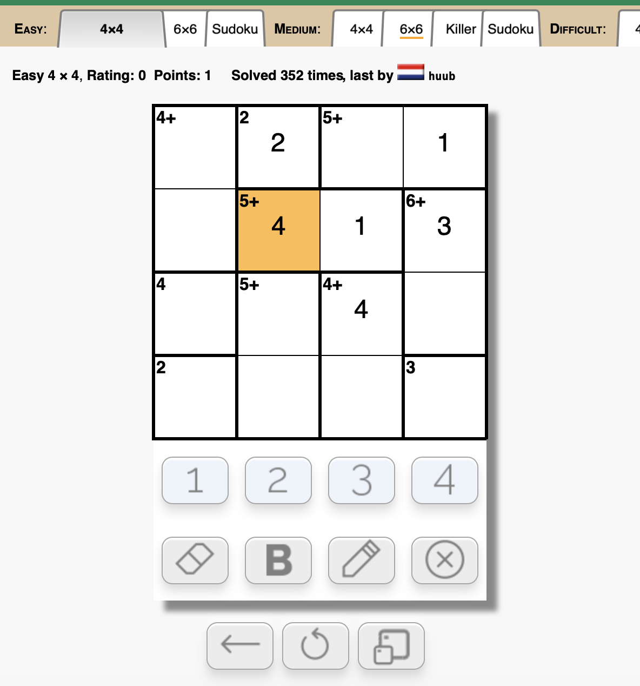

# iwork-02
iOS assignment 2: Calcudoku App.

聪明格(Calcudoku)是一种数字游戏，又被称作升级版的数独。它在数学上的要求比数独要高得多。聪明格把数独规则与加减乘除四则运算相结合，使大脑在各种谜题中来回穿梭。

按照聪明格解题要求，参考[聪明格在线](https://www.calcudoku.org)实现iOS版的聪明格解题游戏。出一道6*6难度的题供用户解题：
1. 功能正确。
2. 界面UI风格不限，颜色不限
4. 用Markdown编写简单项目文档，并展示运行录屏(录屏需上传方便后续浏览)
    - 建议录屏上传方式(二选一)
        - 上传b站，将链接放置/视频嵌入README中
        - 上传自己的Github仓库，视频嵌入README中